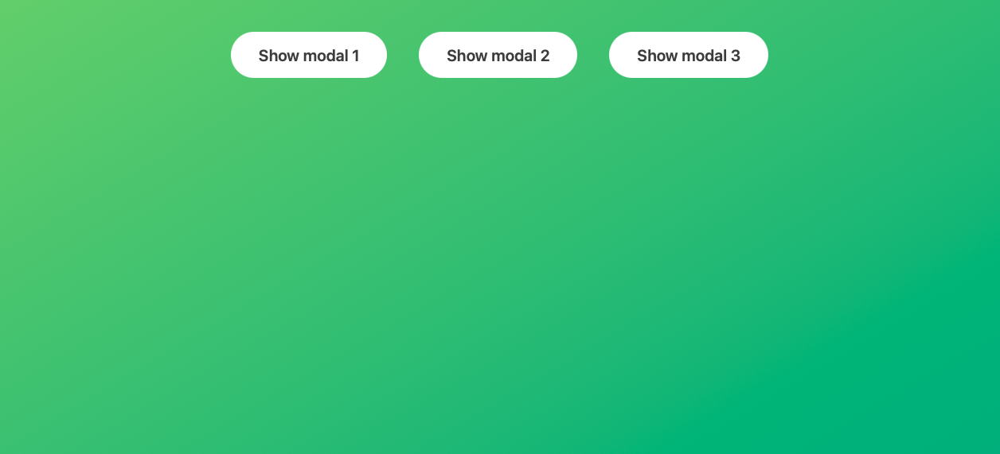
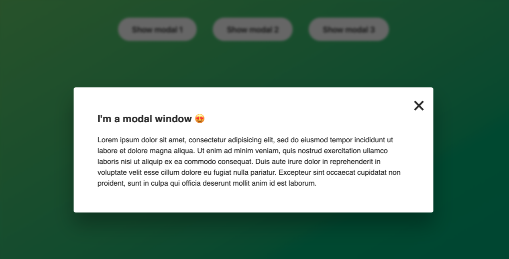

# Modal Window Template

A minimal template demonstrating a modal dialog with an overlay and simple open/close behaviour.

## Preview

Open `index.html` in your browser and click any "Show modal" button to open the modal.

## Files

- `index.html` — markup for the page, modal, and overlay.
- `style.css` — styles for the modal, overlay, and layout.
- `script.js` — JavaScript that opens/closes the modal and handles keyboard/overlay interactions.
- `assets/` — place preview images here (e.g. `modal-preview-1.png`, `modal-preview-2.png`).

## How to use

- Click any "Show modal" button to open the modal.
- Close the modal by:
  - Clicking the × (close) button.
  - Clicking the overlay (outside the modal).
  - Pressing the `Esc` key.

## Key classes & behavior

- `.show-modal` — buttons that open the modal.
- `.modal` — the modal container.
- `.overlay` — page backdrop shown behind the modal.
- `.hidden` — utility class used to hide elements (modal and overlay when closed).
- `.close-modal` — the modal close button.

Check `script.js` for the open/close event handlers and keyboard handling.

## Development / local server

From the project directory (macOS):

- Quick: open in browser
  - Double-click `index.html` or run `open index.html`
- Serve via Python:
  - `python3 -m http.server`
  - Visit `http://localhost:8000`
- Serve via Node (serve):
  - `npx serve .`

## Notes

- This is a simple demo and does not include advanced focus-trap accessibility. Consider adding focus management and ARIA attributes for production use.
